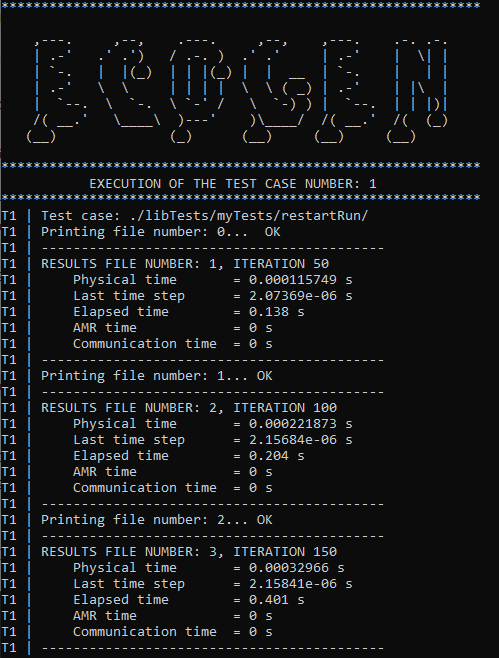
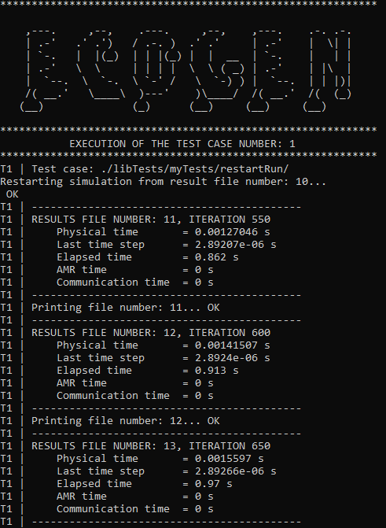
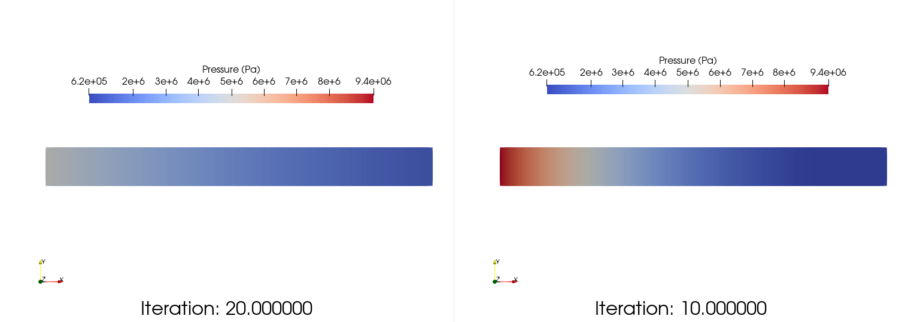

.. role:: xml(code)
  :language: xml

.. _Sec:tuto:resume:

*************
Resume a run
*************

ECOGEN is able to resume a finished computation from given result files. This feature is particularly interesting if a simulation stopped due to computer failure (power cut, unexpected update...) or if the user wants to extent the duration of simulation without restarting from the beginning.

To illustrate this tutorial, we will use a common test case, based on the shock-tube problem available at :ref:`Chap:TestCases`:

.. code-block:: xml

  <testCase>./libTests/referenceTestCases/euler/1D/shockTubes/HPLeft/</testCase>

Setup of the test case
======================

For the purpose of this tutorial we have to do some slight modifications of the test case presented above. We advise you to make a copy of the test case **./libTests/referenceTestCases/euler/1D/shockTubes/HPLeft/** into a new path such as **./libTests/myTests/resumeRun/**.

For the sake of simplicity, we edit the *main.xml* file as following:

.. code-block:: xml

	<?xml version = "1.0" encoding = "UTF-8" standalone = "yes"?>
	<computationParam>
		<run>resumeRun</run>
		<outputMode format="VTK" binary="false" precision="10"/>
		<timeControlMode iterations="true">
			<iterations number="500" iterFreq="50"/>
			<physicalTime totalTime="6.e-4" timeFreq="6e-5"/>
		</timeControlMode>
		<computationControl CFL="0.5"/>
		<secondOrder>
			<globalLimiter>vanleer</globalLimiter>
		</secondOrder>
		<resumeSimulation resumeFileNumber="0" AMRsaveFreq="0"/>
	</computationParam>

We removed the probe section and changed the time control mode to iterations with a printing of data each 50 iterations for a total of 500 iterations.

Following the same idea of simpler test case we edit the file *mesh.xml* by commenting the AMR feature and add more cells:

.. code-block:: xml

	<?xml version="1.0" encoding="UTF-8"?>
	<mesh>
		<type structure="cartesian"/>
		<cartesianMesh>
			<dimensions x="1.0" y="0.1" z="0.1"/>
			<numberCells x="200" y ="1" z="1"/>
			<!-- <AMR lvlMax="3" criteriaVar="0.1" varRho="true" varP="true" varU="false" varAlpha="false" xiSplit="0.11" xiJoin="0.11"/> -->
		</cartesianMesh>
	</mesh>

Now everything is all set, we will run this test case a first time and after that, we will extend the duration of the simulation to 1000 iterations.

.. important::

	To run this simulation, it is required to update the main input file named *ECOGEN.xml* (see :ref:`Sec:tuto:begin`). To add your new run you can add the line :xml:`<testCase>./libTests/myTests/resumeRun/</testCase>` to the end of this file. Be aware to check if other test cases are uncommented to avoid other simulations.

Initial run
===========

Run the simulation with **XX** cores:

.. code-block:: console

	./ECOGEN
	mpirun -np XX ECOGEN

Once started, the output on the console looks like:

  Console screenshot of the initial run.

Once the simulation is done, we can check in the result folder **./results/resumeRun/datasets/** the total number of iterations extracted. The last file has the name *results_CPUxx_TIME10.vtr* which indicates that the number of extracted files is indeed 10 as specified in the *main.xml* file (500 physical iterations, results printed every 50 iterations giving a total of 500/50 = 10 output files). This number corresponds to the *resumeFileNumber* of the the block :xml:`<resumeSimulation>`.

Obviously, in this case we know the total number of time iterations extracted because we waited the end of the simulation. However, it could be useful to get this number if the simulation stopped suddenly, or if the time control mode used was time.

Resume run
==========

Now that we know the last time iteration, we can resume this simulation to add 500 additional time iterations. To this end, we modify the block :xml:`<resumeSimulation>` of the *main.xml* file to specify the last file number:

.. code-block:: xml

	<resumeSimulation resumeFileNumber="10" AMRsaveFreq="0"/>

Accordingly we add the additional time iterations:

.. code-block:: xml

	<iterations number="1000" iterFreq="50"/>

All is left to do is to run again the simulation.

.. important::

	When you choose to resume a simulation you have to use the same number of cores as before.

It is possible to notice on the console output that the simulation is well resumed:

  Console screenshot of the run resumed.

Once the simulation completed, it is possible to compare the initial run with the resumed one:

  Pressure visualization for the resumed and initial runs with a maximal number of extracted files of 20 (left) and 10 (right), respectively.

We can clearly see that at 1000 iterations the expansion fan left the tube on the left side whereas at 500 iterations the initial left state is still present.

Additional remarks
===================

* It is essential that the result folder of the initial simulation keeps the same name for the resumed run.
* For AMR simulations, one also needs to specify the frequency :xml:`AMRsaveFreq` at which necessary resume files are saved (default is 0).
